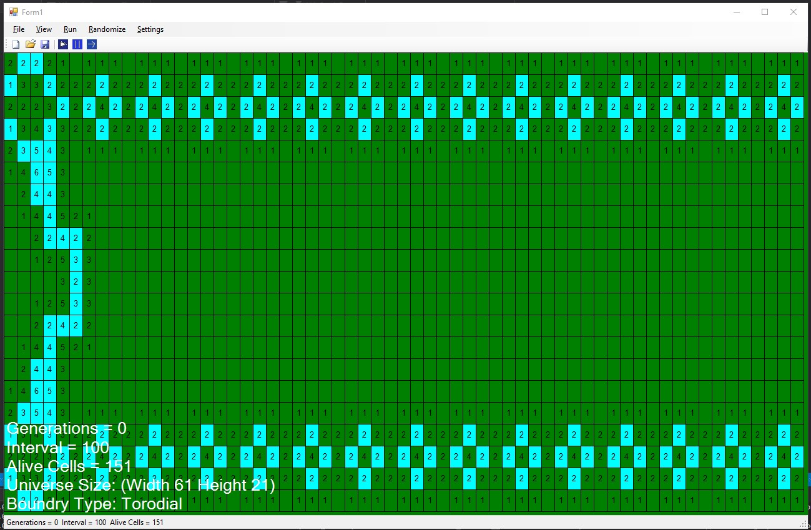

# Game_Of_Life

•	Here we have a windows form application I coded with the help of a base drawing template representing Conway’s game of life and all its rules.

•	This game has clickable cells with various controls to change the colors of the cells, grid lines, hud, back color, etc.

•	The chosen colors will be saved automatically.

•	You can import or open “.cells” files into this application or click on some cells to make your own patterns and hit play to watch the cells react according to the game of life rules.

•	You can also choose between a finite world or a toroidal world where there are no wall boundaries for the cells to move around.

